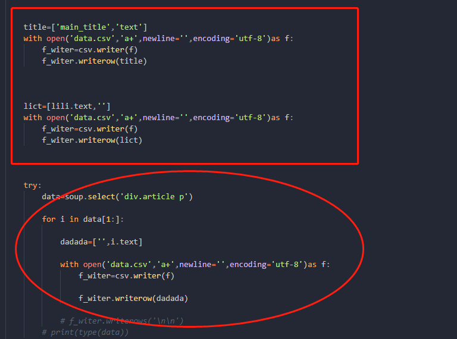

<style> g{ font-size:26px; color: #27408B; background: #54FF9F; border-radius: 5px; opacity: 85%; } </style>

#
# >>>  **<g>先上一整段代码</g>🌱**

- 这段代码是爬🕠取新浪的一小些新闻的内容

```python

import threading # >>>  导入threading模块
from queue import Queue #导入queue模块
import time  #导入time模块
from bs4 import BeautifulSoup
import requests,csv


headers={
    'user-agent':'Mozilla/5.0 (Windows NT 10.0; Win64; x64) AppleWebKit/537.36 (KHTML, like Gecko) Chrome/89.0.4389.82 Safari/537.36',
    'referer':'https://www.sina.com.cn/',
    'cookie':'UOR=k.sina.com.cn,k.sina.com.cn,; SINAGLOBAL=121.9.253.235_1611449179.424202; UM_distinctid=17731db19b82b1-0004d0b6165c72-13e3563-1fa400-17731db19b970b; __gads=ID=df4fa308a570dddb-2298cf56d0c5004d:T=1611449183:RT=1611449183:S=ALNI_MbtRp-YzF-7gGx-NujjFC5A9M3DUQ; SGUID=1611449196613_70486825; SCF=AnC_qgq1ps4o-Yc-DbY4eEuWieUD9LhtwYuOO6ja49vPPA_-WHbZt3ULap3Lw_Iw6Rq555RDGVhtNlJlulYb0-I.; SUB=_2A25NVSaZDeRhGeBN71ER9yfJwz6IHXVuIx9RrDV_PUNbm9AfLUrfkW9NRHpCfyY1v2wQDIaCPSqLiriyF7wU5JJS; SUBP=0033WrSXqPxfM725Ws9jqgMF55529P9D9W55y9gLXw7iZDZCS9XWLEbE5NHD95Qce0B0ehM4SKnEWs4Dqcjqi--ciKL8iK.Ni--Xi-zRiKn7MNH7K2L1; ALF=1647479369; Apache=121.9.253.235_1615943385.326495; U_TRS1=000000eb.7d8a446.605156db.a3b89b60; U_TRS2=000000eb.7d95446.605156db.abf28525; ULV=1615943557205:4:1:1:121.9.253.235_1615943385.326495:1614413510037'
}


def get_detail_url(queue):
    url='https://sina.com.cn'
    html=requests.get(url,headers)
    soup=BeautifulSoup(html.text,'lxml')
    data=soup.select('ul.list-a.news_top li a')
    for i in data:
        # >>>  time.sleep(1)
        queue.put(i['href'])
        print(i['href'])


def get_detail_html(detail_url_queue,id):
    while True:
        url = detail_url_queue.get() #Queue队列的get方法用于从队列中提取元素
        html=requests.get(url,headers)
        html.encoding = ('utf8')


        soup=BeautifulSoup(html.text,'lxml')


        lili=soup.select_one('h1.main-title')
        dada=[]
        dada.append(lili.text)
        


        title=['main_title','text']
        with open('data.csv','a+',newline='',encoding='utf-8')as f:
            f_witer=csv.writer(f)
            f_witer.writerow(title)


        lict=[lili.text,'']
        with open('data.csv','a+',newline='',encoding='utf-8')as f:
            f_witer=csv.writer(f)
            f_witer.writerow(lict)    


        try:
            data=soup.select('div.article p')

            for i in data[1:]:
                              
                dadada=['',i.text]

                with open('data.csv','a+',newline='',encoding='utf-8')as f:
                    f_witer=csv.writer(f)

                    f_witer.writerow(dadada)     

                # >>>  f_witer.writerows('\n\n')
            # >>>  print(type(data))
        except Exception as f:
            print(f)


if __name__ == '__main__':
    detail_url_queue = Queue(maxsize=1000) #用Queue构造一个大小为1000的线程安全的先进先出队列
    # >>>  先创造四个线程
    thread = threading.Thread(target=get_detail_url, args=(detail_url_queue,)) #A线程负责抓取列表url
    html_thread= []
    for i in range(3):
        thread2 = threading.Thread(target=get_detail_html, args=(detail_url_queue,i))
        html_thread.append(thread2)#B C D 线程抓取文章详情
    start_time = time.time()
    # >>>  启动四个线程
    thread.start()
    for i in range(3):
        html_thread[i].start()
    # >>>  等待所有线程结束，thread.join()函数代表子线程完成之前，其父进程一直处于阻塞状态。
    thread.join()
    for i in range(3):
        html_thread[i].join()

    print("last time: {} s".format(time.time()-start_time))#等ABCD四个线程都结束后，在主进程中计算总爬取时间。

```


# >>>  然后我们详👰解一波：


- 
> 上面的框框里面的代码则要和⚪里面的代码写成csv时有先后顺序

> 如果实在理解不了，咱们跑下上面的代码？？

> 框里面的代码每个页面都只跑一边，所以也就是说，每个页面，咱就搞一个header还有main_title，随后就是把内容写在右边


- 读取csv操作

```py

with open('a.csv','r',encoding='UTF-8')as f:
    f_csv = csv.reader(f)
    # >>>  next(f_csv)#可以跳过第一行
    for i in f_csv:
        # >>>  print(i)
        # >>>  或者赋值

```


☪️☪️